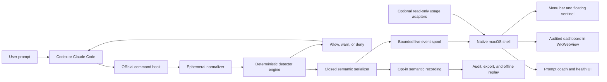

# macOS product architecture

This document defines the target architecture for turning the current hook-based research alpha
into a reliable macOS application. It is a target design, not a claim that every component already
exists.

The public product name is **AWF — Agent Waste Firewall**. The repository, package, and CLI use
the stable technical identifier `agent-waste-firewall`; native bundle identifiers should use the
same namespace before code signing or marketplace publication.

## Product promise and observation boundary

The app should answer, while Codex or Claude Code is working:

1. Is the user's instruction executable, bounded, and verifiable?
2. Is the agent making observable repository progress?
3. Is it repeating reads, commands, tests, failures, waits, or edit/revert cycles without progress?
4. What evidence supports the warning, and what is the smallest useful next prompt?
5. Did the warning reduce actual calls, time, or measured token use?

It must not claim to inspect private model reasoning. It observes official hook events and later,
optionally, provider usage telemetry. Hook coverage is not total: for example, some Codex hosted
tools do not pass through local tool hooks. The UI must say **observed activity**, not “everything
the model thought or did.”

No Accessibility, Screen Recording, terminal scraping, transcript tailing, or keystroke capture is
required. Those mechanisms are less reliable, need broader permissions, and expose more user data
than official hooks.

## Architecture decision

Use a **hybrid native shell**:

- Keep the existing dependency-free Node.js hook worker, normalizer, detector engine, state store,
  semantic trace, replay, and dashboard as the portable core.
- Add a SwiftUI/AppKit macOS application for the menu bar, floating sentinel, settings, integration
  health, notifications, and release packaging.
- Initially render the existing audited dashboard in a `WKWebView`. Migrate individual views to
  native SwiftUI only when doing so provides a measurable usability or accessibility benefit.
- Do not rewrite the detector engine in Swift for the first public beta. One decision engine avoids
  cross-language policy drift.

This is a better fit than Electron for a small always-on monitor, and it avoids adding a Rust bridge
and a second IPC framework solely to use Tauri. The app can remain lightweight while reusing the
working browser UI.

## System context



The raw hook payload crosses exactly one trust boundary: agent process to hook worker over standard
input. It is normalized in memory and is never sent to the macOS app, live event spool, dashboard,
trace, analytics service, crash reporter, or log.

## Runtime components

### 1. Provider hook adapters

Provider manifests translate Codex and Claude Code events into the shared worker:

| Capability | Codex | Claude Code | Shared policy |
| --- | --- | --- | --- |
| Prompt preflight | `UserPromptSubmit` | `UserPromptSubmit` | Evaluate in memory |
| Before tool call | `PreToolUse` | `PreToolUse` | Warn or deny at high confidence |
| Successful/completed tool call | `PostToolUse` | `PostToolUse` | Observe outcome and progress |
| Failed tool call | Failure is represented through supported post-tool data | `PostToolUseFailure` | Normalize to one outcome model |
| Stop | `Stop` | `Stop` | Observation only |
| Distributable integration | Codex plugin hook manifest | Claude plugin hook manifest | Command handler |

Command hooks are the production baseline. Codex currently executes command handlers, while Claude
also offers provider-specific handler types. Using their smallest shared capability keeps the core
portable.

Provider rules:

- Treat additive fields as compatible and unknown fields as untrusted.
- Read only fields explicitly needed by the normalizer.
- Prefer executable plus argument arrays where the provider supports them so paths containing
  spaces are safe.
- Resolve the worker from the provider's plugin-root environment variable, not the current
  repository path.
- Never forward a raw hook body to an HTTP endpoint, including a loopback endpoint.
- Keep `Stop` observation-only. A monitor that automatically resumes a stopped agent can create the
  loop it is meant to prevent.

The implementation should make the provider boundary explicit:

```text
ProviderAdapter
  id
  supportedHooks
  decode(rawPayload) -> CanonicalHookEvent
  encode(decision) -> ProviderHookResponse
  integrationHealth() -> HealthStatusV1
```

Provider detection, failure-event differences, and response encoding are currently distributed
between the manifests, normalizer, and engine. Extracting this interface is preparation work; the
existing normalization heuristics can remain behind it.

Codex hook trust is user-controlled. The installer may explain and verify the hook, but it must not
pretend that trust review can be bypassed. Claude development builds can load a checkout with
`claude --plugin-dir`; public distribution should use a signed, versioned plugin release.

### 2. Hook worker and detector engine

The hook worker is the authoritative hot path and must work when the GUI is closed:

```text
stdin JSON
  -> select allowlisted fields
  -> normalize provider event
  -> update bounded per-session state
  -> run prompt/progress/repetition detectors
  -> serialize a provider response to stdout
  -> best-effort publish one audited semantic event
```

The worker must:

- make no network request;
- make no model call;
- have no install-time npm dependencies;
- emit only provider JSON on standard output;
- keep diagnostics on standard error and rate-limit them;
- fail open on crashes, timeouts, corrupt optional telemetry, or an unavailable UI;
- use per-session locking so concurrent agents do not overwrite each other;
- finish under 100 ms at p95 on supported Macs, measured from fixture-driven integration tests.

Blocking belongs only in `PreToolUse` or a deliberately configured prompt preflight, and only when
evidence is high confidence. Post-tool warnings cannot undo a side effect.

### 3. Semantic boundary

Define separate data types for separate trust levels:

| Type | Lifetime | May contain | Must never contain |
| --- | --- | --- | --- |
| `ProviderHookEnvelope` | Hook process memory | Provider event required for this decision | Any persisted copy |
| `NormalizedEvent` | Hook process and bounded detector state | Hashes, enums, operation class, progress evidence | Prompt, command, output, source content |
| `LiveEventV1` | Short-lived local spool | Closed enums, counts, severity, rule and issue IDs, scoped aliases | Paths, file names, prose, timestamps, raw IDs |
| `TraceEventV1` | Explicit recording/export | Existing audited semantic trace schema | Any unknown key or free text |
| `UsageSampleV1` | Optional local measurement store | Provider, time bucket, actual token/cost counters when available | Prompt or transcript content |
| `HealthStatusV1` | App memory | Installed/running/version/latency states | Hook payloads or repository data |

`LiveEventV1` should reuse the strict trace vocabulary but does not need an active export
recording. It should be written to a bounded, user-only local spool with a short default retention.
The macOS app consumes only this audited stream. An explicit recording still creates a new
trace-scoped HMAC key and the stricter export lifecycle already implemented in `TraceStore`.

Do not implement collection as “save the JSON and redact it later.” Construct each event from a
closed allowlist and reject unknown fields before the first write.

### 4. Live event transport

Use a small disk-backed semantic spool as the primary transport for the first beta:

- It survives app restarts.
- The hook does not wait for a socket, daemon, or UI.
- The app can catch up after launch.
- It is testable with ordinary fixture files.
- It contains only audited semantic events.

Publish each event under a short global lock, or as a private temporary file followed by an atomic
rename into a spool directory. Bound the spool by both event count and age. The app watches the
directory, validates every event again, updates its in-memory projection, and removes or compacts
acknowledged events.

A Unix domain socket can later reduce display latency, but it is an optimization. If added, the
same event must be validated before sending, the hook must use a very short non-blocking timeout,
and disk remains the fallback. XPC is appropriate only after the engine becomes a signed native
helper; it is not required to ship the first shell.

### 5. Native macOS shell

The application owns presentation and lifecycle, not detection:

- `MenuBarExtra`: always-visible status, current mode, active session count, latest evidence, pause,
  and open-dashboard actions.
- Main window: live timeline, prompt coach, session selector, privacy controls, integration health,
  and local data management.
- Floating sentinel: a borderless non-activating `NSPanel`, user-positionable and optionally kept
  above normal windows. It shows the transparent magnifying-glass eye.
- Notifications: rate-limited summaries for meaningful severity transitions, never for every
  repeated event.
- Start at login: an explicit toggle backed by `SMAppService`; hook correctness must not depend on
  it.
- Engine supervisor: locates the bundled worker, reports its version, starts the local dashboard
  when requested, and restarts presentation services with bounded backoff.
- Integration manager: installs, upgrades, validates, and uninstalls only AWF-owned plugin
  files. It shows every target path before mutation and never silently edits unrelated user config.

Use `WKWebsiteDataStore.nonPersistent()` for the embedded dashboard so its random loopback token is
not retained in normal WebKit history, cookies, or website data. Navigation must remain on the
expected loopback origin and must not open arbitrary URLs inside the app.

Visual state is a pure projection of the semantic stream:

| State | Trigger | Sentinel |
| --- | --- | --- |
| `clear` | Connected, no active warning | Transparent eye with green accent |
| `review` | Medium warning or weak evidence | Transparent eye with yellow accent |
| `danger` | High-confidence or blockable incident | Transparent eye with red accent |
| `critical` | Repeated high-severity incidents without progress | Red eye and red translucent panel background |
| `offline` | No recent validated event or worker health failure | Neutral gray; never imply safety |

Severity decays only after a validated progress event, user acknowledgement, or a documented idle
timeout. Opening or closing a window must not clear it.

### 6. Prompt coach

The deterministic coach uses five contract slots:

1. task and target;
2. explicit scope and exclusions;
3. observable definition of done;
4. verification method;
5. stop condition or budget.

The raw prompt remains inside the hook process. The hook may return a tailored suggestion directly
to Codex or Claude Code because it already received that prompt, but the app receives only issue IDs
and renders a safe generic template. It must not reconstruct or display the original prompt.

An optional model-assisted coach is post-beta work. It must be opt-in, clearly disclose the extra
token and network cost, send only user-approved text, and never sit on the hook decision path.

### 7. Usage measurement

Hooks do not provide a universal exact token counter. Keep these concepts separate:

- **Waste evidence:** repeated behavior without observable progress.
- **Avoidable-call candidate:** a call associated with such evidence.
- **Measured use:** exact provider token/time/cost counters from a supported read-only adapter.
- **Estimated savings:** not shown unless the estimate and uncertainty are explicit.

Usage adapters run asynchronously and annotate already-created semantic incidents. Their absence,
delay, authentication failure, or schema change must never affect allow/warn/deny decisions. Do not
convert calls to tokens with a fixed multiplier.

## Process and bundle layout

Target direct-distribution bundle:

```text
AWF.app/
  Contents/
    MacOS/AWF
    Frameworks/
    Helpers/awf-worker
    Resources/
      dashboard/
      plugins/
        codex/
        claude/
```

Recommended source layout:

```text
macos/
  AWF.xcodeproj
  AWF/
    App/
    Dashboard/
    Engine/
    Integrations/
    MenuBar/
    Sentinel/
    Settings/
    Resources/
  AWFTests/
  AWFUITests/
src/                         # existing portable detector core
hooks/                       # provider manifests
test/                        # existing Node tests
docs/
```

For an early developer preview, requiring Node.js 18+ is acceptable and keeps iteration fast. A
public consumer beta should bundle a pinned worker runtime so the app does not depend on a user's
shell `PATH`, version manager, or Homebrew installation. The bundled runtime and every nested
helper must be signed as part of the app. Keep the portable source and CLI runnable with system
Node for contributors.

The public hook manifest should call a small stable launcher in an app-owned per-user integration
directory, not an absolute path inside `/Applications/AWF.app`. The app can be moved, and
provider trust should not change for every runtime upgrade. Install versions side by side, validate
the new worker with `doctor`, then atomically switch a `current` pointer. Keep an installation
ledger so repair, rollback, and uninstall touch only files created by AWF.

Do not choose the Mac App Store first. Provider plugin installation and execution of a bundled
helper need to be proven under sandbox constraints. Start with hardened-runtime, Developer
ID-signed, notarized direct distribution; evaluate App Sandbox and the Store as a separate
milestone.

## Failure policy

| Failure | Required behavior |
| --- | --- |
| macOS app is not running | Hook still detects, warns, and can deny |
| Semantic spool is unavailable | Skip presentation event, rate-limit stderr warning, do not block agent |
| Hook worker crashes or exceeds its budget | Fail open; provider continues |
| Session state is corrupt | Quarantine/replace only that state; do not persist raw recovery input |
| Provider adds fields | Ignore unknown input fields; contract tests detect breaking removals |
| Multiple sessions run concurrently | Lock per session; aggregate only audited aliases in the app |
| Disk is full | Never fall back to raw logs; display degraded health when possible |
| Dashboard crashes | Restart with bounded backoff; detector remains independent |
| Usage adapter fails | Mark measurement unavailable; do not infer zero use |
| App version and plugin version differ | Show a repair action; do not silently mix incompatible protocols |

## Security and privacy invariants

- Local-first and offline by default.
- No raw prompt, hook body, command, tool output, transcript, source content, or crash attachment.
- No telemetry or update check without an explicit, documented network feature.
- User-only permissions for data directories and event files.
- Loopback-only dashboard with a random bearer token and no external assets.
- Closed schemas validated before persistence and again before display/export.
- No raw provider/session/tool identifiers; use domain-separated HMAC aliases.
- Separate app, protocol, state, and trace schema versions with tested migrations.
- Warnings describe evidence and attribution; they do not assign personal blame.
- Installer operations are scoped, inspectable, reversible, and do not overwrite unrelated config.

## Versioned migration from the current alpha

1. Extract the existing dashboard projection into a documented `LiveEventV1` schema.
2. Add a bounded semantic spool and tests while retaining the current explicit trace path.
3. Add the native shell with menu bar, `WKWebView`, sentinel, and read-only health checks.
4. Add explicit install/repair/uninstall flows for each provider.
5. Bundle and sign the worker runtime; add protocol compatibility checks.
6. Add optional usage adapters only after the decision path is stable.
7. Run an observe-only pilot, label results, tune thresholds, then enable `warn` by default.
8. Consider `block` for public use only after the evaluation gates are met.

Current migration debt to address explicitly:

- provider decoding and provider response encoding are not yet an isolated adapter interface;
- the live dashboard currently depends on one active recording;
- status and SSE polling repeatedly read the semantic trace rather than following an incremental
  cursor;
- the browser dashboard is a large combined asset module;
- current manifests invoke `node` from the user's environment;
- Node remains the sole owner of detector state; the Swift app must never read or co-write those
  internal state JSON files.

## Release gates

A public beta is a no-go unless:

- the existing Node checks and tests pass;
- native unit and UI tests pass on supported macOS versions;
- hook p95 latency is below 100 ms in a cold/warm fixture benchmark;
- killing the app during a hook call does not break the coding agent;
- privacy canaries are rejected before persistence;
- Codex and Claude integration install, repair, upgrade, and uninstall tests pass;
- false blocking remains below the documented evaluation threshold;
- the app and nested worker are Developer ID signed, hardened, notarized, and the ticket is stapled;
- a clean Mac can install and remove the app without manual residue outside documented data files.

## Official integration references

- [Codex hooks reference](https://learn.chatgpt.com/docs/hooks.md)
- [Codex plugin development](https://developers.openai.com/plugins/build/plugins)
- [Claude Code hooks reference](https://code.claude.com/docs/en/hooks)
- [Claude Code hooks guide](https://code.claude.com/docs/en/hooks-guide)
- [Claude Code plugins](https://code.claude.com/docs/en/plugins)
- [Apple `MenuBarExtra`](https://developer.apple.com/documentation/swiftui/menubarextra)
- [Apple `SMAppService`](https://developer.apple.com/documentation/servicemanagement/smappservice)
- [Apple `WKWebView`](https://developer.apple.com/documentation/webkit/wkwebview/)
- [Notarizing macOS software](https://developer.apple.com/documentation/security/notarizing-macos-software-before-distribution)
- [Creating distribution-signed code for macOS](https://developer.apple.com/documentation/xcode/creating-distribution-signed-code-for-the-mac/)
