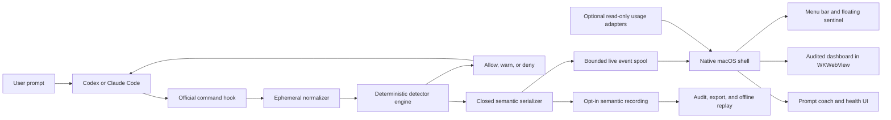

# macOS product architecture

This document defines the target architecture for turning the current hook-based research alpha
into a reliable macOS application. It is a target design, not a claim that every component already
exists.

The public product name is **AWF — Agent Waste Firewall**. The repository, package, and CLI use
the stable technical identifier `agent-waste-firewall`; native bundle identifiers should use the
same namespace before code signing or marketplace publication.

## Product promise and observation boundary

The app should answer, while Codex or Claude Code is working:

1. Is the user's instruction executable, bounded, and verifiable?
2. Is the agent making observable repository progress?
3. Is it repeating reads, commands, tests, failures, waits, or edit/revert cycles without progress?
4. What evidence supports the warning, and what is the smallest useful next prompt?
5. Did the warning reduce actual calls, time, or measured token use?

It must not claim to inspect private model reasoning. It observes official hook events and later,
optionally, provider usage telemetry. Hook coverage is not total: for example, some Codex hosted
tools do not pass through local tool hooks. The UI must say **observed activity**, not “everything
the model thought or did.”

No Accessibility, Screen Recording, terminal scraping, transcript tailing, or keystroke capture is
required. Those mechanisms are less reliable, need broader permissions, and expose more user data
than official hooks.

## Architecture decision

Use a **hybrid native shell**:

- Keep the existing dependency-free Node.js hook worker, normalizer, detector engine, state store,
  semantic trace, replay, and dashboard as the portable core.
- Add a SwiftUI/AppKit macOS application for the menu bar, floating sentinel, settings, integration
  health, notifications, and release packaging.
- Initially render the existing audited dashboard in a `WKWebView`. Migrate individual views to
  native SwiftUI only when doing so provides a measurable usability or accessibility benefit.
- Do not rewrite the detector engine in Swift for the first public beta. One decision engine avoids
  cross-language policy drift.

This is a better fit than Electron for a small always-on monitor, and it avoids adding a Rust bridge
and a second IPC framework solely to use Tauri. The app can remain lightweight while reusing the
working browser UI.

## System context



The raw hook payload is passed on standard input through the provider-launched command path to the
hook worker. AWF's launcher does not consume or persist it; the worker normalizes it in memory.
Provider and shell startup are part of the trusted delivery path, while the macOS app, live event
spool, dashboard, trace, analytics service, crash reporter, and logs never receive the raw payload.

## Runtime components

### 1. Provider hook adapters

Provider manifests translate Codex and Claude Code events into the shared worker:

| Capability | Codex | Claude Code | Shared policy |
| --- | --- | --- | --- |
| Prompt preflight | `UserPromptSubmit` | `UserPromptSubmit` | Evaluate in memory |
| Before tool call | `PreToolUse` | `PreToolUse` | Warn or deny at high confidence |
| Successful/completed tool call | `PostToolUse` | `PostToolUse` | Observe outcome and progress |
| Failed tool call | Failure is represented through supported post-tool data | `PostToolUseFailure` | Normalize to one outcome model |
| Stop | `Stop` | `Stop` | Observation only |
| Distributable integration | Codex plugin hook manifest | Claude plugin hook manifest | Command handler |

Command hooks are the production baseline. Codex currently executes command handlers, while Claude
also offers provider-specific handler types. Using their smallest shared capability keeps the core
portable.

Provider rules:

- Treat additive fields as compatible and unknown fields as untrusted.
- Read only fields explicitly needed by the normalizer.
- Prefer executable plus argument arrays where the provider supports them so paths containing
  spaces are safe.
- Resolve the worker from the provider's plugin-root environment variable, not the current
  repository path.
- Never forward a raw hook body to an HTTP endpoint, including a loopback endpoint.
- Keep `Stop` observation-only. A monitor that automatically resumes a stopped agent can create the
  loop it is meant to prevent.

The checked-in provider manifests continue to invoke the plugin-root `/bin/sh -p` shim; they do
not contain an app-bundle path or a generated per-user command. On macOS, that shim may prefer the
fixed per-user native helper only when the matching provider-root environment identifies exactly
one of Codex or Claude. A missing or unsafe helper, or an ambiguous provider match, leaves the
portable external-Node alpha path available. Once the shim invokes the native helper, that helper
validates activation and stdin has crossed the handoff boundary: activation failure must fail open
without retrying the event through Node or appending a second JSON value.

The implementation should make the provider boundary explicit:

```text
ProviderAdapter
  id
  supportedHooks
  decode(rawPayload) -> CanonicalHookEvent
  encode(decision) -> ProviderHookResponse
  integrationHealth() -> HealthStatusV1
```

Provider detection, failure-event differences, and response encoding are currently distributed
between the manifests, normalizer, and engine. Extracting this interface is preparation work; the
existing normalization heuristics can remain behind it.

Codex hook trust is user-controlled. The installer may explain and verify the hook, but it must not
pretend that trust review can be bypassed. Claude development builds can load a checkout with
`claude --plugin-dir`; public distribution should use a signed, versioned plugin release.

### 2. Hook worker and detector engine

The hook worker is the authoritative hot path and must work when the GUI is closed:

```text
stdin JSON
  -> select allowlisted fields
  -> normalize provider event
  -> update bounded per-session state
  -> run prompt/progress/repetition detectors
  -> serialize a provider response to stdout
  -> best-effort publish one audited semantic event
```

The worker must:

- make no network request;
- make no model call;
- have no install-time npm dependencies;
- emit only provider JSON on standard output;
- keep diagnostics on standard error and rate-limit in-worker warnings; the pre-runtime launcher
  instead emits one fixed, raw-free warning for each event it cannot check;
- fail open on crashes, timeouts, corrupt optional telemetry, or an unavailable UI;
- use per-session locking so concurrent agents do not overwrite each other;
- finish under 100 ms at p95 on supported Macs, measured from fixture-driven integration tests.

Blocking belongs only in `PreToolUse` or a deliberately configured prompt preflight, and only when
evidence is high confidence. Post-tool warnings cannot undo a side effect.

### 3. Semantic boundary

Define separate data types for separate trust levels:

| Type | Lifetime | May contain | Must never contain |
| --- | --- | --- | --- |
| `ProviderHookEnvelope` | Hook process memory | Provider event required for this decision | Any persisted copy |
| `NormalizedEvent` | Hook process and bounded detector state | Hashes, enums, operation class, progress evidence | Prompt, command, output, source content |
| `LiveEventV1` | Short-lived local spool | Closed enums, counts, severity, rule and issue IDs, scoped aliases | Paths, file names, prose, timestamps, raw IDs |
| `TraceEventV1` | Explicit recording/export | Existing audited semantic trace schema | Any unknown key or free text |
| `UsageSampleV1` | Optional local measurement store | Provider, time bucket, actual token/cost counters when available | Prompt or transcript content |
| `HealthStatusV1` | App memory | Installed/running/version/latency states | Hook payloads or repository data |

`LiveEventV1` reuses the strict trace vocabulary and does not need an active export recording.
The worker now writes it to a bounded, user-only local spool with hard ceilings of 4,096 events and
8 MiB plus a 24-hour age trigger enforced on next access; configuration may only lower them. Each
generation uses a fresh HMAC alias key. The macOS developer preview consumes only closed
dashboard/provider projections derived from this audited stream through its loopback worker; it
does not read detector state or raw spool records. An explicit recording still creates a separate
trace-scoped HMAC key and uses the stricter export lifecycle implemented in `TraceStore`.

Do not implement collection as “save the JSON and redact it later.” Construct each event from a
closed allowlist and reject unknown fields before the first write.

### 4. Live event transport

Use a small disk-backed semantic spool as the primary transport for the first beta:

- It survives app restarts.
- The hook does not wait for a socket, daemon, or UI.
- The app can catch up after launch.
- It is testable with ordinary fixture files.
- It contains only audited semantic events.

The implemented worker publishes each event under a short global lock as a private temporary file
followed by an atomic rename. It bounds each generation by event count, bytes, and age, validates
events again on read, and recovers interrupted pending publications. The implemented browser-side
cursor reads stable control/event/control windows without taking that lock, incrementally validates
committed appends, periodically re-audits the bounded generation, and projects source, health,
coverage, and generation reset states through the loopback dashboard. A native Swift watcher still
remains future work; it should consume the same contract rather than read detector state.

A Unix domain socket can later reduce display latency, but it is an optimization. If added, the
same event must be validated before sending, the hook must use a very short non-blocking timeout,
and disk remains the fallback. XPC is appropriate only after the engine becomes a signed native
helper; it is not required to ship the first shell.

### 5. Native macOS shell

The application owns presentation and lifecycle, not detection:

- `MenuBarExtra`: always-visible status, current mode, active session count, latest evidence, pause,
  and open-dashboard actions.
- Main window: live timeline, prompt coach, session selector, privacy controls, integration health,
  and local data management.
- Floating sentinel: a borderless non-activating `NSPanel`, user-positionable and optionally kept
  above normal windows. It shows the transparent magnifying-glass eye.
- Notifications: rate-limited summaries for meaningful severity transitions, never for every
  repeated event.
- Start at login: an explicit toggle backed by `SMAppService`; hook correctness must not depend on
  it.
- Engine supervisor: locates the bundled worker, reports its version, starts the local dashboard
  when requested, and restarts presentation services with bounded backoff.
- Integration manager: installs, upgrades, validates, and uninstalls only AWF-owned plugin
  files. It shows every target path before mutation and never silently edits unrelated user config.

Use `WKWebsiteDataStore.nonPersistent()` for the embedded dashboard so its random loopback token is
not retained in normal WebKit history, cookies, or website data. Navigation must remain on the
expected loopback origin and must not open arbitrary URLs inside the app.

Visual state is a pure projection of the semantic stream:

| State | Trigger | Sentinel |
| --- | --- | --- |
| `clear` | Connected, no active warning, and fresh audited provider activity | Transparent eye with green accent |
| `review` | Medium warning, empty/retained stream, expired activity, or weak provider evidence | Transparent eye with yellow accent |
| `danger` | High-confidence or blockable incident | Transparent eye with red accent |
| `critical` | Repeated high-severity incidents without progress | Red eye and red translucent panel background |
| `offline` | No recent validated event or worker health failure | Neutral gray; never imply safety |

Severity decays only after a validated progress event, user acknowledgement, or a documented idle
timeout. Opening or closing a window must not clear it.

### 6. Prompt coach

The deterministic coach uses five contract slots:

1. task and target;
2. explicit scope and exclusions;
3. observable definition of done;
4. verification method;
5. stop condition or budget.

The raw prompt remains inside the hook process. The hook may return a tailored suggestion directly
to Codex or Claude Code because it already received that prompt, but the app receives only issue IDs
and renders a safe generic template. It must not reconstruct or display the original prompt.

An optional model-assisted coach is post-beta work. It must be opt-in, clearly disclose the extra
token and network cost, send only user-approved text, and never sit on the hook decision path.

### 7. Usage measurement

Hooks do not provide a universal exact token counter. Keep these concepts separate:

- **Waste evidence:** repeated behavior without observable progress.
- **Avoidable-call candidate:** a call associated with such evidence.
- **Measured use:** exact provider token/time/cost counters from a supported read-only adapter.
- **Estimated savings:** not shown unless the estimate and uncertainty are explicit.

Usage adapters run asynchronously and annotate already-created semantic incidents. Their absence,
delay, authentication failure, or schema change must never affect allow/warn/deny decisions. Do not
convert calls to tokens with a fixed multiplier.

## Process and bundle layout

Target direct-distribution bundle:

```text
AWF.app/
  Contents/
    MacOS/AWF
    Frameworks/
    Helpers/
      awf-hook                 # implemented hardened Swift helper
      awf-node                 # release-generated pinned runtime; not committed
    Resources/
      dashboard/
      plugins/
        codex/
        claude/
```

Recommended source layout:

```text
macos/
  AWF.xcodeproj
  AWF/
    App/
    Dashboard/
    Engine/
    Integrations/
    MenuBar/
    Sentinel/
    Settings/
    Resources/
  AWFTests/
  AWFUITests/
src/                         # existing portable detector core
hooks/                       # provider manifests
test/                        # existing Node tests
docs/
```

For an early developer preview, requiring Node.js 18+ is acceptable and keeps iteration fast. A
public consumer beta should bundle a pinned worker runtime so the app does not depend on a user's
shell `PATH`, version manager, or Homebrew installation. The bundled runtime and every nested
helper must be signed as part of the app. Keep the portable source and CLI runnable with system
Node for contributors.

The current alpha routes macOS/POSIX hooks through a plugin-root inner launcher and removes
inherited `PATH` lookup from both that launcher and the native dashboard locator after they start.
After `/bin/sh -p` has started and the launcher has control, it removes Node and dynamic-loader
variables, validates the plugin-root worker, and on macOS derives the provider only from an exact,
unambiguous `PLUGIN_ROOT` or `CLAUDE_PLUGIN_ROOT` match. It then checks the fixed per-user native
helper at
`~/Library/Application Support/io.github.thisisun.agent-waste-firewall/integration-v1/awf-hook`.
A safe native helper is preferred. If the helper or its integration directory is missing or
unsafe, or provider attribution is ambiguous, the shim falls back to the existing explicit,
bounded external Node locations. After native invocation, success or failure terminates the shim;
the raw stdin is never replayed and a second JSON response is never appended.

This does not sanitize provider or initial interpreter/loader startup. Claude's exec-form hook
adds no command-evaluation shell, but its provider-to-`/bin/sh` startup remains trusted. Codex
additionally evaluates the command through inherited `$SHELL -lc`, which is outside AWF's boundary
and direct launcher tests. See the
[Codex command-runner source](https://github.com/openai/codex/blob/main/codex-rs/hooks/src/engine/command_runner.rs#L125-L164).
This native-first dispatch closes a runtime-selection foundation gap; it does not satisfy the
bundled-runtime release gate or harden provider/interpreter startup.

The Xcode app now builds a hardened-runtime Swift `awf-hook` target and embeds it with
`CodeSignOnCopy` at `Contents/Helpers/awf-hook`. Those settings fit the checked-in inside-out
release-sealing pipeline; the current source artifact has no Developer ID signature or
notarization. It also contains no generated `awf-node` payload. The activation UI and lifecycle
manager are implemented, but fail closed until release assembly supplies a signed runtime and an
outer-sealed post-sign digest.

The fixed per-user integration has this exact activation record, including its trailing newline:

```json
{"v":1,"releaseId":"rel_0123456789abcdef0123456789abcdef","workerProtocol":1}
```

`releaseId` is exactly `rel_` followed by 32 lowercase hexadecimal characters. The manifest stores
no path; the helper reconstructs and validates only this layout:

```text
~/Library/Application Support/io.github.thisisun.agent-waste-firewall/
  integration-v1/
    awf-hook
    activation.json
    install-ledger.json
    versions/
      rel_<32 lowercase hex>/
        awf-node
```

The native helper also validates the absolute plugin root and its `scripts/hook.mjs`. It receives
`hook --protocol 1 --provider <codex|claude> --plugin-root <absolute path>`, inherits the provider's
standard handles without reading or copying raw stdin, and launches the worker with a closed
environment plus `PATH=/usr/bin:/bin`. The worker child owns a separate process group and a
2.25-second deadline. Deadline cleanup terminates, then forcibly kills if necessary, and reaps the
owned group. Before child handoff, launch failures return the fixed raw-free fail-open response.
After handoff, the helper may warn but cannot append another JSON value.

The app installs this per-user tree rather than ask provider manifests to call an absolute path
inside `/Applications/AWF.app`. The app can be moved, and provider trust does not need to change
for every runtime upgrade. The implementation validates the whole payload before mutation, stages
on the same volume, publishes versions side by side, validates the new active install, then
atomically replaces the canonical regular-file activation manifest. A closed ownership ledger
records helper/runtime digests; repair creates a new release, rollback selects only a verified
candidate, and uninstall preserves unknown or changed residue.

Do not choose the Mac App Store first. Provider plugin installation and execution of a bundled
helper need to be proven under sandbox constraints. Start with hardened-runtime, Developer
ID-signed, notarized direct distribution; evaluate App Sandbox and the Store as a separate
milestone.

## Failure policy

| Failure | Required behavior |
| --- | --- |
| macOS app is not running | Hook still detects, warns, and can deny |
| Semantic spool is unavailable | Skip presentation event, rate-limit stderr warning, do not block agent |
| Hook worker crashes or exceeds its budget | Fail open; provider continues |
| Native hook child exceeds 2.25 seconds | Terminate and reap its owned process group; do not retry stdin or append a second response |
| Session state is corrupt | Quarantine/replace only that state; do not persist raw recovery input |
| Provider adds fields | Ignore unknown input fields; contract tests detect breaking removals |
| Multiple sessions run concurrently | Lock per session; aggregate only audited aliases in the app |
| Disk is full | Never fall back to raw logs; display degraded health when possible |
| Dashboard crashes | Restart with bounded backoff; detector remains independent |
| Usage adapter fails | Mark measurement unavailable; do not infer zero use |
| App version and plugin version differ | Show a repair action; do not silently mix incompatible protocols |

## Security and privacy invariants

- Local-first and offline by default.
- No raw prompt, hook body, command, tool output, transcript, source content, or crash attachment.
- No telemetry or update check without an explicit, documented network feature.
- User-only permissions for data directories and event files.
- Loopback-only dashboard with a random bearer token and no external assets.
- Closed schemas validated before persistence and again before display/export.
- No raw provider/session/tool identifiers; use domain-separated HMAC aliases.
- Separate app, protocol, state, and trace schema versions with tested migrations.
- Warnings describe evidence and attribution; they do not assign personal blame.
- Installer operations are scoped, inspectable, reversible, and do not overwrite unrelated config.

## Versioned migration from the current alpha

1. ~~Define and validate the documented `LiveEventV1` schema.~~ Completed.
2. ~~Add a bounded semantic spool and tests while retaining the explicit trace path.~~ Completed.
3. ~~Connect a generation-aware live-spool cursor to the shared dashboard projection.~~ Completed.
4. ~~Add the native shell with menu bar, `WKWebView`, sentinel, and read-only health checks.~~
   Developer preview implemented; signed distribution and native UI acceptance remain pending.
5. ~~Add explicit local install/repair/rollback/uninstall with atomic activation of the embedded
   native helper.~~ Implemented with a closed ownership ledger and fail-closed native UI.
6. ~~Pin and verify an architecture-specific Node payload and define post-sign sealing.~~ Node
   `v24.18.0` preparation and finalization are implemented; Developer ID signing, notarization,
   clean-machine assembly, and protocol handshake acceptance remain.
7. Add optional usage adapters only after the decision path is stable.
8. Run an observe-only pilot, label results, tune thresholds, then enable `warn` by default.
9. Consider `block` for public use only after the evaluation gates are met.

Current migration debt to address explicitly:

- provider decoding and provider response encoding are not yet an isolated adapter interface;
- the browser dashboard is a large combined asset module;
- macOS/POSIX manifests still use a transitional plugin-root shell shim. The macOS shim can prefer
  a safe fixed per-user helper. Release assembly must supply the generated signed Node payload
  before the implemented installer can activate it; Windows provider-hook execution remains
  unsupported;
- Node remains the sole owner of detector state; the Swift app must never read or co-write those
  internal state JSON files.

## Release gates

A public beta is a no-go unless:

- the existing Node checks and tests pass;
- native unit and UI tests pass on supported macOS versions;
- hook p95 latency is below 100 ms in a cold/warm fixture benchmark;
- killing the app during a hook call does not break the coding agent;
- privacy canaries are rejected before persistence;
- Codex and Claude integration install, repair, upgrade, and uninstall tests pass;
- false blocking remains below the documented evaluation threshold;
- the app and nested worker are Developer ID signed, hardened, notarized, and the ticket is stapled;
- a clean Mac can install and remove the app without manual residue outside documented data files.

## Official integration references

- [Codex hooks reference](https://learn.chatgpt.com/docs/hooks.md)
- [Codex plugin development](https://developers.openai.com/plugins/build/plugins)
- [Claude Code hooks reference](https://code.claude.com/docs/en/hooks)
- [Claude Code hooks guide](https://code.claude.com/docs/en/hooks-guide)
- [Claude Code plugins](https://code.claude.com/docs/en/plugins)
- [Apple `MenuBarExtra`](https://developer.apple.com/documentation/swiftui/menubarextra)
- [Apple `SMAppService`](https://developer.apple.com/documentation/servicemanagement/smappservice)
- [Apple `WKWebView`](https://developer.apple.com/documentation/webkit/wkwebview/)
- [Notarizing macOS software](https://developer.apple.com/documentation/security/notarizing-macos-software-before-distribution)
- [Creating distribution-signed code for macOS](https://developer.apple.com/documentation/xcode/creating-distribution-signed-code-for-the-mac/)
